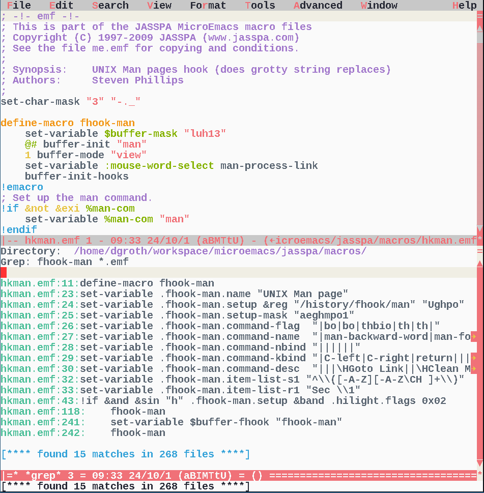

## MicroEmacs &nbsp;&nbsp;&nbsp;&nbsp;&nbsp;&nbsp;&nbsp;&nbsp;&nbsp;&nbsp;&nbsp;&nbsp; 

* [Jasspa homepage](http://www.jasspa.com)
* [new mailing list](https://groups.google.com/g/jasspa-microemacs)
* [old downloads](http://www.jasspa.com/downlatest.html)
* [standalone executables](http://www.jasspa.com/zeroinst.html)
* [quick start](http://www.jasspa.com/release_20090909/jasspame.pdf)
* [spelling dictionaries](http://www.jasspa.com/spelling.html)
* [online help](http://www.jasspa.com/me.html)

This is a fork of [Jasspa MicroEmacs](http://www.jasspa.com) forked from [https://github.com/vitalyster/microemacs](https://github.com/vitalyster/microemacs).

It contains the following changes:

* fix for str_errlist[errno] by replacing it with strerror(errno) on Linux x64
  Fedora with gcc 10.3
* adding schemes (themes) [Ayu Light](https://github.com/ayu-theme/ayu-colors)
  and [Dracula](https://github.com/dracula/dracula-theme)
* Markdown mode (folding, template file, syntax hilghlighting, outline
  in item list, embedding Tcl and R code in fences with syntax highlight)


Here the Ayu Light theme which is defined in the file [schemeal.emf](src/macros/schemeal.emf)



Here the popular "Dracula" theme which is defined in the file [schemedr.emf](src/macros/schemedr.emf).

See the folding feature for Markdown, in the image below (Dracula theme) the section
build is folded by the indicated three dots:


## Download 

There is a stand alone single file executable build for the following platforms here: 

* [Linux-x86_64](https://github.com/mittelmark/microemacs/suites/4587289431/artifacts/123655903)
* [Windows-32bit](https://github.com/mittelmark/microemacs/suites/4587422309/artifacts/123662018)

The Windows 32 bit executable should as well work in Windows 64bit system.

Other platforms will follow.

## Pros and Cons of Jasspa MicroEmacs

* Pro:
    * emacs like coding
    * distraction free coding, no popups, no annoying updates - just you and the editor
    * easy to extend, the file _USER.emf_ can is your friend
    * same features in terminal and in GUI mode
    * small and fast
    * different color themes can be used and changed easily
    * many platforms supported see here: [http://www.jasspa.com/zeroinst.html](http://www.jasspa.com/zeroinst.html)
* Cons:
    * no unicode!
    * no softwrap!
    
## Build

I currently build only on Linux using the file _src/linux26.gmk_. Other Makefiles you should take from [https://github.com/ipstone/microemacs/tree/master/src](https://github.com/ipstone/microemacs/tree/master/src)

To build switch into the src directory and then run the Makefile for your plaform. On my Linux machine I did:

```
make -f linux26.gmk
```

## Original README

Here the link to the original Jasspa MicroEmacs [README](README).

## Links

* [Jasspa Homepage](http://www.jasspa.com/)
* [Github Repo with sources from 2010 with fixes for Mingw64 but removed Makefiles (terminal build via cmake)](https://github.com/vitalyster/microemacs)
* [Github Repo with sources from 2010 and fixes for Mac and BSD](https://github.com/ipstone/microemacs)
* [Github Repo with sources from 2009](https://github.com/cstrotm/jasspa-microemacs)
* [Github Repo with fixes for MSDOS](https://github.com/robdaemon/microemacs)
* [MicroEmacs Online Help](http://www.jasspa.com/me.html)
* [MicroEmacs Refcard](http://www.jamesie.de/microemacs/me-refcard.pdf)
* [MicroEmacs.de](http://www.dgroth.de/pmwiki/index.php?n=MicroEmacs.MicroEmacs)
* [MicroEmacs chm file (2002)](http://www.dgroth.de/downloads/me2002.chm)

## License

MicroEmacs is released with the GPL, see the file [license.txt](license.txt).

## EOF
