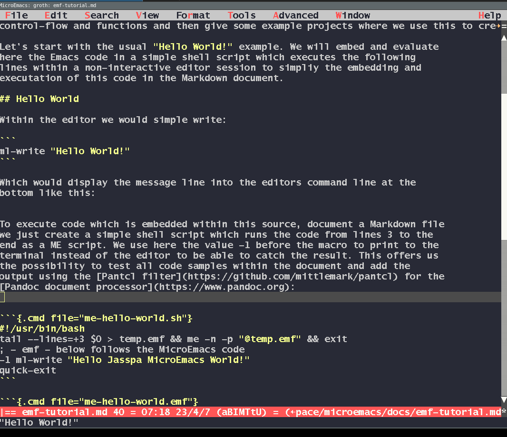

## Introduction

This is a tutorial about the [Jasspa MicroEmacs](http://www.jasspa.com)
language. We will cover the basic features of the language, variables, data
structures, control-flow and functions and then give some example projects
where we use this to create some useful extensions.

Let's start with the usual "Hello World!" example. We will embed and evaluate
here the Emacs code in a simple shell script which executes the following
lines within a non-interactive editor session to simpliy the embedding and
executation of this code in the Markdown document.

## Hello World

Within the editor we would simple write:

```
ml-write "Hello World!"
```

Which would display the message line into the editors command line at the
bottom like this:



To execute the code which is embedded within this source document, a Markdown file,
we just create a simple shell script which runs the code from lines 3 to the
end as a ME script. We use here the value -1 before the macro to print to the
terminal instead of the editor to be able to catch the result. This offers us
the possibility to test all code samples within the document and add the
output using the [Pantcl filter](https://github.com/mittlemark/pantcl) for the
[Pandoc document processor](https://www.pandoc.org):


```{.cmd file="me-hello-world.sh"}
#!/usr/bin/bash
tail --lines=+3 $0 > temp.emf && me -n -p "@temp.emf" && exit
; - emf - below follows the MicroEmacs code
-1 ml-write "Hello Jasspa MicroEmacs World!"
quick-exit
```

This will be explained later:

```{.cmd file="me-hello-world.emf"}
#!/usr/bin/bash
tail --lines=+3 $0 > temp.emf && me -n -p "@temp.emf" && exit
; - emf - below follows the MicroEmacs code
-1 ml-write "Hello Jasspa MicroEmacs World!"
-1 ml-write &cat "This is MicroEmacs " &cat $version "!"
set-variable %x 1
!while &less %x 10
    -1 ml-write &cat "x is " %x
    set-variable %x &inc %x 1
!done
quick-exit
```

## Variables

- register variables
- local variables
- global variables

## Data structures

- scalars
- list

## Control-Flow

- if, elseif, else
- while, until

## Functions - Macros

- define-macro
- define-help

## Document generation

Thsi document was generated using pandoc and the pantcl filter like this:

```
pandoc --filter pantcl emf-tutorial.md -o emf-tutorial.html -s --css mini.css
```


